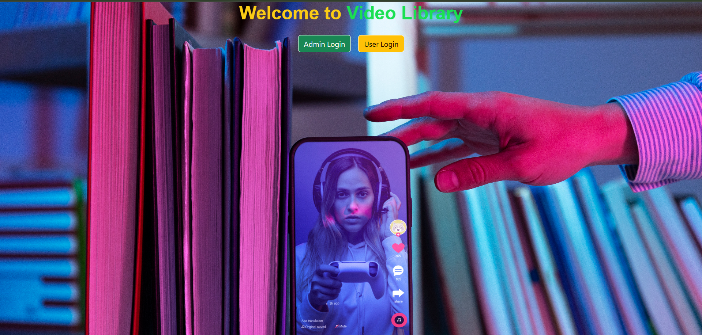
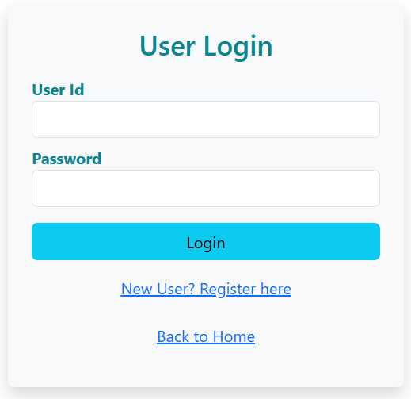
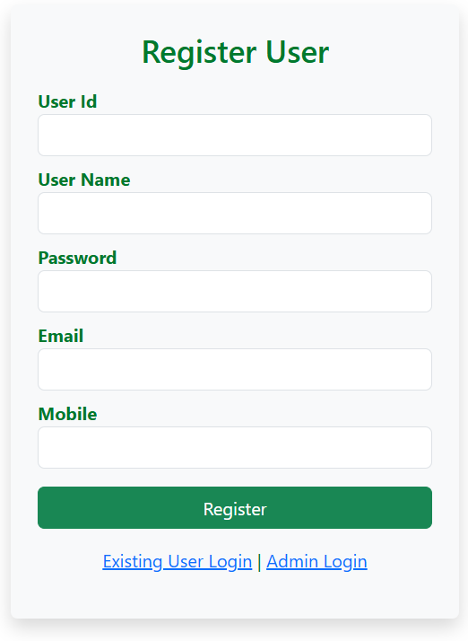

# 🎬 Video Library App

A modern web-based video library platform for Admins and Users to log in and access video content.

## 🚀 Live Deployment

🔗 [Click here to view the live app](https://video-library-app-new.netlify.app/)

---

## 📸 Screenshot

> Make sure the screenshot path is correct or replace with a public image URL (e.g. from GitHub or Imgur).

---

## 🛠️ Tech Stack

- ⚛️ React (Vite)
- 🎨 Tailwind CSS + Bootstrap
- 🔒 Google Authentication (for Admin)
- 🌐 React Router
- 📦 Axios
- ☁️ Backend: MongoDB Atlas (via Express.js)
- 🔗 Deployed on: Netlify (Frontend), Render (Backend)

---

## 📁 Project Structure

